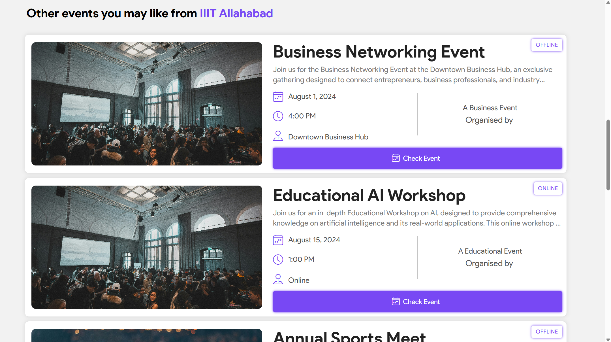

## UpEvent🎉
##### Share your events and stay updated😄
 - This application is developed by Himanshu Kabra, Antriksh Gupta and Heet Goyani for event management and information circulation at university level.

## Features✨
- Organize and Manage events and registrations.
- Share events among friends.
- Filter, Register and Bookmark events accoding to interest.
- Set reminders on google calander.

### Key Steps

1. **Registration and Login**
   - Click on the "Register" button on the landing page to create an account.
   - Use the login credentials to access the app.

2. **User Community Features**
   - Explore the events posted by organizers.
   - Register or book events of interest.
   - View event details, including location, description, availability, and social media links.
   - Remove bookmarks or registrations as needed.

3. **Organizer Community Features**
   - Log in as an organizer using the provided credentials.
   - Access the dashboard to create, update, or delete events.
   - Update university details in the settings section.
   - Create events by providing event information, description, and uploading a cover image.
   - Ensure the event description is more than 300 characters.
   - Upload a cover image for the event.
   - Review and confirm the event creation.

### Cautionary Notes
- Event descriptions must be detailed and exceed 300 characters.
- Uploading a cover image is mandatory for creating an event.
- Ensure all information provided during event creation is accurate and complete.

### Tips for Efficiency
- Familiarize yourself with the app's user and organizer interfaces.
- Regularly update event details and university information for accuracy.
- Double-check event descriptions and cover image uploads before creating an event.
- Follow the steps in a sequential order to avoid errors in event management.

Link to Loom

https://www.loom.com/share/8471fbeb856a4686ae3236b0ad0a82a6

## Authors👨‍💻
- [@Himanshukabra22](https://www.github.com/Himanshukabra22) - Backend
- [@Antriksh1305](https://github.com/Antriksh1305) - Frontend and Design
- [@Heet-Goyani](https://github.com/Heet-Goyani) - Frontend and Design

## Techstack💡
- ReactJs
- NodeJs (Express)
- MySQL (Sequelize)
- Cloudinary API


## How to use (Commands)⚡
```bash
git clone https://github.com/Himanshukabra22/UpEvent-WebD
cd UpEvent-WebD
```

- Terminal 1 (Backend):
```bash
cd ./backend
npm i
npm start
```
- Terminal 2 (Frontend):
```bash
cd ./my-app
npm i
npm run dev
```

    
## User Interface💯





