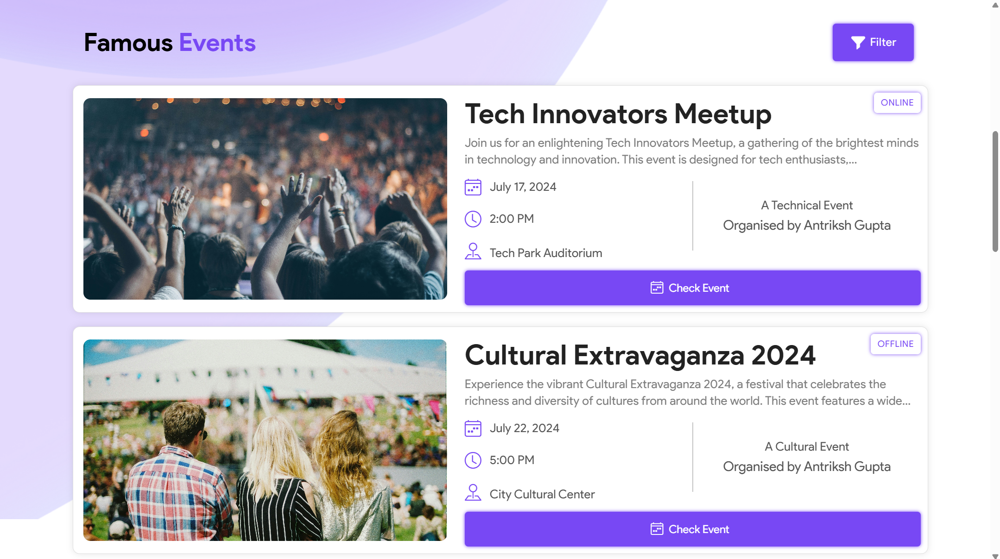

## UpEvent🎉
##### Share your events and stay updated😄
 - This application is developed by Himanshu Kabra, Antriksh Gupta and Heet Goyani for event management and information circulation at university level.

## Features✨
- Organize and Manage events and registrations.
- Share events among friends.
- Filter, Register and Bookmark events accoding to interest.
- Set reminders on google calander.


## Authors👨‍💻
- [@Himanshukabra22](https://www.github.com/Himanshukabra22) - Backend
- [@Antriksh1305](https://github.com/Antriksh1305) - Frontend and Design
- [@Heet-Goyani](https://github.com/Heet-Goyani) - Frontend and Design

## Techstack💡
- ReactJs
- NodeJs (Express)
- MySQL (Sequelize)
- Cloudinary API


## How to use (Commands)⚡
```bash
git clone https://github.com/Himanshukabra22/UpEvent-WebD
cd UpEvent-WebD
```

- Terminal 1 (Backend):
```bash
cd ./backend
npm i
npm start
```
- Terminal 2 (Frontend):
```bash
cd ./my-app
npm i
npm run dev
```

    
## User Interface💯





